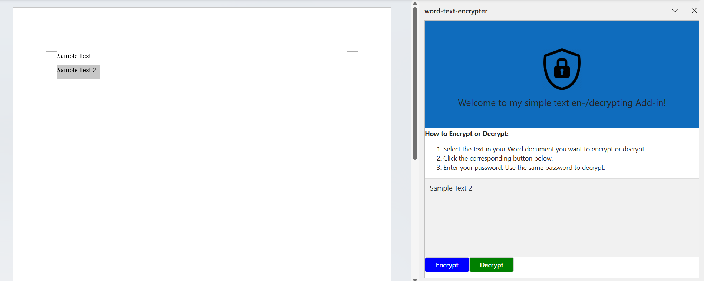
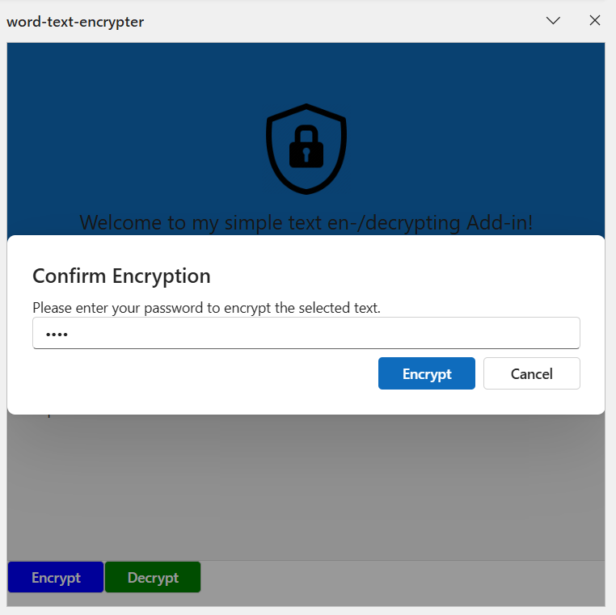
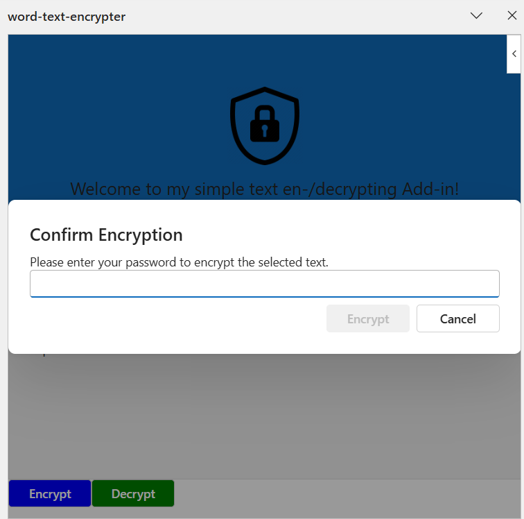
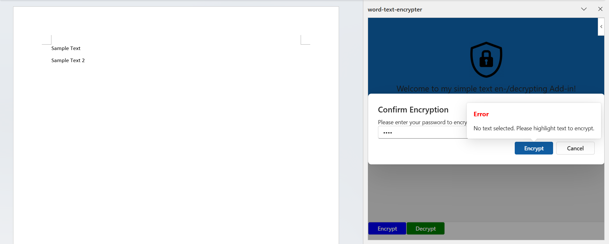
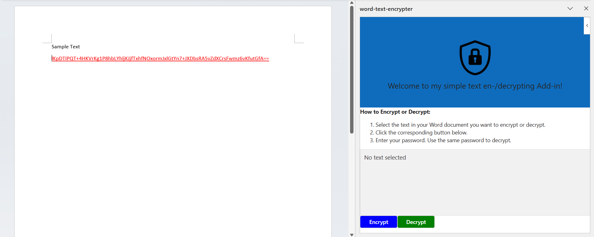
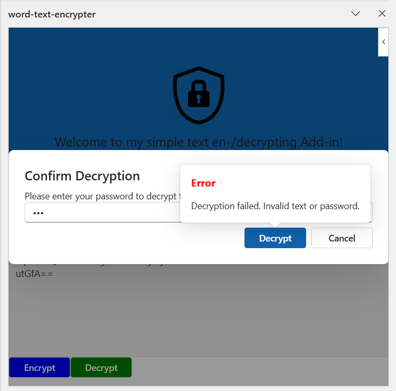

# Simple Text En-/Decryption Add-in for Microsoft Word

## Table of Contents

1. [Getting started](#getting-started)
2. [Application Functionalities](#functionalities)

## Getting started

### Prerequisites

Ensure the following software components are installed on your PC:

- [ ] Node.js (JavaScript runtime environment)
- [ ] npm (Node Package Manager)
- [ ] Git

1. Install __Node.js__ and __npm__

   Visit the [Node.js website](https://nodejs.org/).
   Download the recommended version for your platform (LTS version is recommended).
   Follow the installation instructions for your operating system.
   Verify the installation:

    ```bash
    node -v
    npm -v
    ```

2. Install __Git__

   Visit the [Git website](https://git-scm.com/).
   Download the recommended version for your platform.
   Follow the installation instructions for your operating system.
   Verify the installation:

    ```bash
    git -v
    ```

### Clone the Repository

Clone the repository to your local machine:

```bash
git clone https://github.com/sthiohnoo/Add-in_word_text_encrypting.git
```

### Setup

### Step 1: Install Dependencies

Install the necessary dependencies using npm:

```bash
npm install
```

### Step 2: Build

```bash
npm run build
```

### Step 3: Start the Add-in

```bash
npm start
```

### Step 4: Use Add-in

Once the add-in has successfully started, Microsoft Word will open automatically with the add-in loaded.

Alternatively: Open Microsoft Word and go to the 'Add-Ins' tab in the toolbar to launch the add-in.

## Functionalities

- Mark any text in the document and click the "Encrypt" button to encrypt. The marked text will be displayed in the text
  area.

  

- Enter a password to proceed with the encryption.

  

- The "Encrypt" button is disabled until a password is entered.

  

- If you try to encrypt without selecting any text, an error message will be displayed.

  

- After successful encryption, the selected text will be replaced with the encrypted version. The encrypted text will be
  displayed in red with a double underline.

  

- The decryption process is similar to the encryption process. If the password is incorrect or invalid text is selected,
  an error message will be displayed.

  
